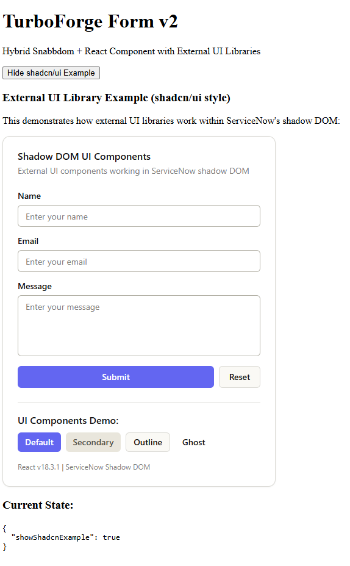

# @turboforge/tf-form-v2

A working demo of React components nested within ServiceNow's Snabbdom components, featuring full shadcn/ui integration with proper styling in the shadow DOM.



## Features

- **Hybrid Architecture**: Snabbdom parent component with React child components
- **React 18 Support**: Full React 18 hooks and features via `@quixomatic/ui-renderer-react-simple`
- **shadcn/ui Integration**: Complete shadcn/ui components with proper styling
- **Tailwind CSS**: Configured for shadow DOM with CSS variables support
- **ServiceNow Shadow DOM**: Properly isolated styles that work within ServiceNow's shadow DOM

## Working Demo

This project demonstrates:
- ✅ React components rendering inside ServiceNow shadow DOM
- ✅ shadcn/ui components with full styling support
- ✅ Tailwind CSS with shadow DOM compatibility
- ✅ Interactive form handling with React state management
- ✅ CSS variables properly configured for both `:root` and `:host`

## Project Structure

```
src/
├── index.js                                    # Main component export
├── components/ui/                              # shadcn/ui components
│   ├── button.jsx                             # Button component
│   ├── input.jsx                              # Input component
│   ├── label.jsx                              # Label component
│   ├── card.jsx                               # Card component
│   └── textarea.jsx                           # Textarea component
├── lib/utils.js                               # Utility functions (cn, etc)
├── styles/tailwind.css                        # Tailwind CSS configuration
└── x-312987-tf-form-v-2/                      # Main component
    ├── index.js                               # Component definition (Snabbdom)
    ├── styles.scss                            # Component styles
    ├── styles/_tailwind-generated.css         # Generated Tailwind CSS
    └── components/                            # Sub-components
        └── shadcn-example/                    # React shadcn/ui example
            ├── index.js                       # React component registration
            ├── view.js                        # React component implementation
            └── styles.scss                    # Component styles with Tailwind
```

## Setup

### 1. Install Dependencies

```bash
# Install the React renderer and React 18
npm install @quixomatic/ui-renderer-react-simple react@18 react-dom@18

# Install shadcn/ui dependencies
npm install @radix-ui/react-label @radix-ui/react-slot class-variance-authority clsx tailwind-merge lucide-react

# Install Tailwind CSS
npm install tailwindcss@^3.4.17
```

### 2. React Renderer Setup

Run the automated setup:

```bash
# Set up the fake @servicenow/ui-renderer-react package
npx setup-servicenow-react

# Patch the babel plugin (if needed)
node patch-babel-plugin.js
```

### 3. Tailwind CSS Setup

Generate the Tailwind CSS for shadow DOM:

```bash
# Build Tailwind CSS with shadow DOM support
npm run build:css-prod
```

This generates `src/x-312987-tf-form-v-2/styles/_tailwind-generated.css` with:
- CSS variables for both `:root` and `:host` (shadow DOM compatibility)
- All shadcn/ui utility classes
- Proper styling for the shadow DOM environment

### 4. Development

```bash
# Start development server
snc ui-component develop

# Build for production
snc ui-component build

# Watch Tailwind CSS changes during development
npm run build:css
```

## Key Features Demonstrated

### React in Shadow DOM
- React components render correctly within ServiceNow's shadow DOM
- Full React 18 features including hooks and state management
- Proper event handling and component lifecycle

### shadcn/ui Integration
- Complete shadcn/ui components (Button, Input, Label, Card, Textarea)
- All variants and sizes working properly
- Proper focus states and accessibility

### Tailwind CSS in Shadow DOM
- CSS variables defined for both `:root` and `:host`
- Automatic shadow DOM compatibility
- All utility classes available to React components

### State Management
- Communication between Snabbdom parent and React child components
- ServiceNow's dispatch/action system for component communication
- React state management with hooks

## Configuration Files

- `tailwind.config.js` - Tailwind configuration with shadow DOM support
- `components.json` - shadcn/ui configuration
- `jsconfig.json` - Path mapping for imports
- `package.json` - Build scripts for CSS generation

## Build Process

1. **CSS Generation**: `npm run build:css-prod` generates Tailwind CSS with shadow DOM variables
2. **Component Build**: `snc ui-component build` builds the ServiceNow component
3. **Development**: `npm run build:css` watches for Tailwind changes during development

## License

MIT